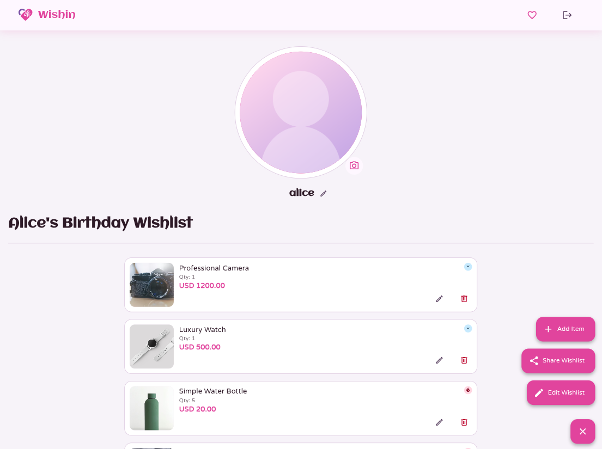
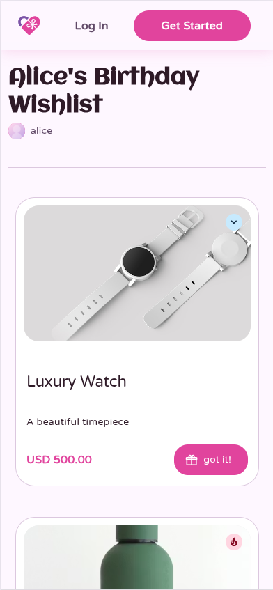
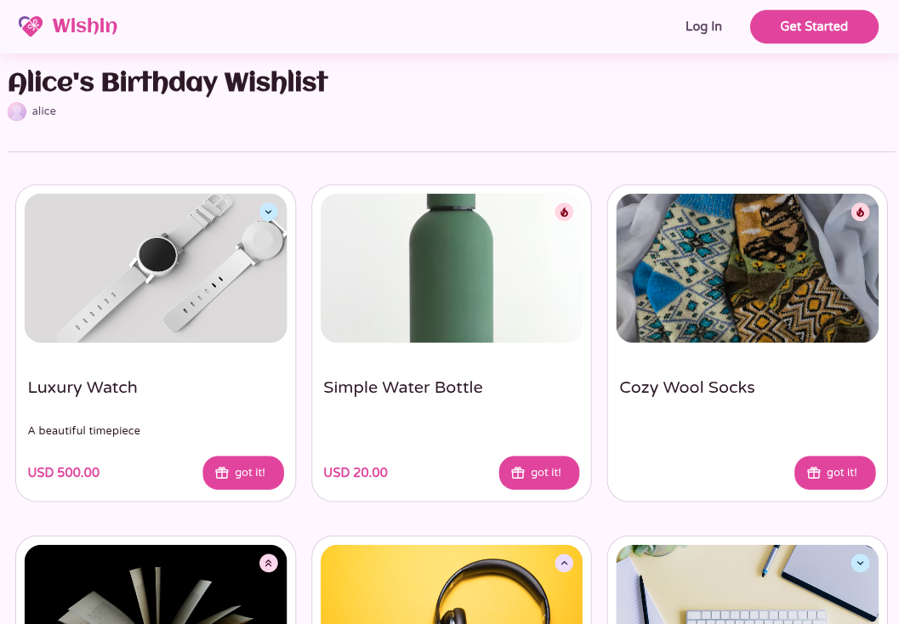

# Wishin


## Vision

Wishin is a high-performance, real-time collaborative platform designed for frictionless gift coordination. By combining a hybrid access model with an atomic inventory system, Wishin ensures that wishlists remain accurate and synchronized, whether contributors are registered members or anonymous guests.

## Core Functionality

- **Hybrid Participation Model:** Optimized for zero-friction; anonymous guests can mark items as "purchased" via unique sharing URLs, while registered users gain access to a "reservation" phase.
- **Two-Stage Item Commitment:** A robust lifecycle management system with distinct states: `Available`, `Reserved` (temporary lock), and `Purchased` (final state).
- **Atomic Inventory Control:** A synchronization engine that manages item quantities (including unlimited status) via server-side atomic operations to ensure data integrity.
- **Real-Time State Updates (Planned):** Instant broadcast of status changes across all clients via Appwrite Realtime (WebSockets).

## UI Showcase

| Feature       | Mobile View                                                   | Desktop View                                                        |
| :------------ | :------------------------------------------------------------ | :------------------------------------------------------------------ |
| **Landing**   |         |      |
| **Dashboard** |     |  |
| **Wishlist**  |  |    |

## Technical Stack

| Layer              | Technology                                              |
| :----------------- | :------------------------------------------------------ |
| **Frontend**       | Expo (React Native) + TypeScript + React 19 (Web-First) |
| **Backend (BaaS)** | Appwrite Cloud                                          |
| **UI Framework**   | React Native Paper (Material Design 3)                  |
| **Testing Suite**  | Vitest & React Native Testing Library                   |
| **E2E Testing**    | Playwright (Web) & Maestro (Mobile - Planned)           |
| **AI Governance**  | CodeRabbit (Automated Architectural Review)             |

## Quality Gates & Engineering Standards

### 🛡️ Security & Privacy

- **Security by Design:** Implementation of link-based authorization (Capability-based Security) for guest access and identity-based access for registered users.
- **Security by Default:** All data structures are private. Access is granted only via explicit ownership or possession of a secure, cryptographically signed sharing token.

### 🧪 Testing & Reliability

- **TDD Discipline:** Strict adherence to the Red-Green-Refactor workflow. No production code is implemented without a preceding failing test.
- **Test Coverage:** Mandatory minimum threshold of **80% coverage** for Domain and Application layers.
- **Concurrency Management:** Engineered to handle race conditions between guest purchases and member reservations using atomic database operations.

### 🏗️ Architecture & Project Structure

Wishin uses a modern monorepo architecture to share domain logic across platforms while keeping infrastructure separate.

```text
.
├── apps
│   └── expo-client          # Expo (React Native) application (Web/Mobile)
├── packages
│   ├── domain               # Pure business logic (Entities, Interfaces)
│   ├── infrastructure       # Appwrite adapters, Storage, Auth implementations
│   └── shared               # Shared types, constants, and global utilities
├── docs
│   ├── adr                  # Architectural Decision Records
│   └── assets               # Project assets and screenshots
└── scripts                  # Database provisioning and seeding tools
```

- **Clean Architecture:** Strict separation of concerns using Domain-Driven Design (DDD).
- **Decoupled Infrastructure:** Implementation of the **Repository and Adapter Patterns** to isolate the business logic from the Appwrite SDK.
- **Strict Type Safety:** Comprehensive TypeScript enforcement (`no-explicit-any`) across the entire stack to catch errors at compile time.
- **Material Design 3:** Full adoption of MD3 principles via `react-native-paper`.
  - **Theming:** Centralized theme system using MD3 tokens (e.g., `surface`, `onPrimary`) via `useTheme()` hook.
  - **Components:** Custom components like `PriorityBadge` for consistent status visualization across the app.

### 🛠️ Development Workflow & Automation

- **Pre-commit Hooks (Husky + lint-staged):** Automated execution of ESLint (including security plugins), Prettier, and Unit Tests on staged files to prevent regression.
- **Commit Validation (Commitlint):** Strict enforcement of the [Conventional Commits specification](https://www.conventionalcommits.org/) at the Git level to ensure transparent version history.
- **Pre-push Checks:** Final local validation of the full test suite before remote synchronization.

### 🤖 AI Governance & Planned Observability

- **Automated AI Review:** Integration of CodeRabbit to enforce architectural constraints and identify logical edge cases in every Pull Request.
- **Observability (Planned):** Full visibility into system health and user behavior via Sentry (Errors) and PostHog (Analytics) is currently in the roadmap.
- **Real-time Telemetry:** Proactive monitoring of critical state changes and concurrency conflicts.

## 🚀 Getting Started

Follow these steps to set up the project locally for development.

### Prerequisites

- **Node.js**: v20 or higher.
- **pnpm**: v10 or higher.
- **Expo Go** (Optional): Available on iOS/Android for mobile testing.
- **Appwrite Cloud Account**: Needed for the backend (free tier is sufficient).

### Step 1: Clone & Install

```bash
# Clone the repository
git clone https://github.com/ZoePorta/wishin.git
cd wishin

# Install dependencies
pnpm install

# Initialize husky hooks
pnpm prepare
```

### Step 2: Environment Setup

1. Copy the example environment file:
   ```bash
   cp .env.example .env
   ```
2. Open `.env` and fill in your Appwrite credentials (Project ID, Endpoint, API Secret, etc.). See the [Infrastructure](#infrastructure--database-setup) section for details on these variables.

### Step 3: Database Provisioning

Initialize your Appwrite database schema and seed it with test data:

```bash
# Create collections and attributes
pnpm db:provision

# (Optional) Seed the database with sample wishlists/items
pnpm db:seed
```

---

### Step 4: Running the App (Web-First)

The project currently prioritizes a **responsive web experience**. While Expo allows for native mobile distributions, these are scheduled for the **Post-MVP** phase.

```bash
# Start the development server for Web
pnpm --filter @wishin/expo-client web
```

- Using the `web` command directly ensures the best development experience for the current target.
- For experimental mobile testing via **Expo Go**, you can use `pnpm --filter @wishin/expo-client start` and scan the QR code.

---

### Step 5: Testing & Quality

Always run tests before pushing any changes.

```bash
# Run unit tests (Vitest)
pnpm test

# Run integration tests (Requires environment setup)
pnpm test:integration

# Run linting and type checks
pnpm lint
pnpm type-check
```

---

### 📜 Monorepo Scripts

The root `package.json` provides unified commands to manage the entire workspace.

| Command                 | Description                                      |
| :---------------------- | :----------------------------------------------- |
| `pnpm install`          | Installs all dependencies across all packages.   |
| `pnpm build`            | Builds all packages and apps.                    |
| `pnpm test`             | Runs the full test suite (Vitest).               |
| `pnpm test:integration` | Runs integration tests (requires DB setup).      |
| `pnpm lint`             | Runs ESLint and Prettier checks.                 |
| `pnpm type-check`       | Validates TypeScript across the monorepo.        |
| `pnpm db:provision`     | Initializes Appwrite collections and attributes. |
| `pnpm db:seed`          | Populates the database with realistic test data. |

---

## Infrastructure & Database Setup

The project uses Appwrite as a BaaS. To manage namespacing and idempotency across development environments, use the following provisioning tools.

### Environment Variables

Ensure your `.env` file (copied from `.env.example`) contains:

- `EXPO_PUBLIC_APPWRITE_ENDPOINT`: Your Appwrite API endpoint.
- `EXPO_PUBLIC_APPWRITE_PROJECT_ID`: Your Appwrite project ID.
- `EXPO_PUBLIC_APPWRITE_DATABASE_ID`: The ID of the database to use.
- `EXPO_PUBLIC_APPWRITE_STORAGE_BUCKET_ID`: Appwrite storage bucket for file assets (Required for local runs using Appwrite).
- `APPWRITE_API_SECRET`: Required for server-side management.
- `EXPO_PUBLIC_DB_PREFIX`: Prefix for collections (e.g., `dev`, `test`).
  - **Note**: For local integration tests, set `EXPO_PUBLIC_DB_PREFIX=test` and ensure `EXPO_PUBLIC_APPWRITE_STORAGE_BUCKET_ID` is correctly configured.

### Database Scripts

| Command                    | Description                                                                         |
| :------------------------- | :---------------------------------------------------------------------------------- |
| `npm run db:provision`     | Idempotent creation of DB, collections, and attributes using the `.env` prefix.     |
| `npm run db:reset`         | **Destructive**: Deletes all collections matching current prefix and re-provisions. |
| `npm run db:seed`          | Populates the database with test data.                                              |
| `npm run db:seed:test`     | Populates the test database with test data.                                         |
| `npm run test:integration` | Automates `test` prefix provisioning, cleanup, and runs the test suite.             |

## Architectural Decision Records (ADR)

- [ADR 001: BaaS Infrastructure Alignment](docs/adr/001-baas-infrastructure-alignment.md)
- [ADR 002: Architectural Patterns and Decoupling](docs/adr/002-architectural-patterns-and-decoupling.md)
- [ADR 003: Monorepo Organizational Strategy](docs/adr/003-monorepo-organizational-strategy.md)
- [ADR 004: Local Development Workflow and Quality Automation](docs/adr/004-local-development-workflow-and-quality-automation.md)
- [ADR 005: Adopt Vitest for Testing](docs/adr/005-adopt-vitest-for-testing.md)
- [ADR 006: Domain Modeling Patterns](docs/adr/006-domain-modeling-patterns.md)
- [ADR 007: Validation Modes & Legacy Data Strategy](docs/adr/007-validation-modes.md)
- [ADR 008: Explicit Cancellation Flow](docs/adr/008-explicit-cancellation-flow.md)
- [ADR 009: Client-Side Undo Window](docs/adr/009-client-side-undo-window.md)
- [ADR 010: Wishlist Privacy and Access Control](docs/adr/010-wishlist-privacy-and-access-control.md)
- [ADR 011: Explicit Visibility and Participation](docs/adr/011-explicit-visibility-participation.md)
- [ADR 012: Wishlist Aggregate Encapsulation](docs/adr/012-wishlist-aggregate-encapsulation.md)
- [ADR 013: Unified Transaction State Model](docs/adr/013-unified-transaction-state-model.md)
- [ADR 014: Identity and Repository Mapping Strategy](docs/adr/014-identity-and-repository-mapping-strategy.md)
- [ADR 015: Automated Infrastructure Provisioning and Namespacing](docs/adr/015-automated-infrastructure-provisioning-and-namespacing.md)
- [ADR 016: Database Seeding Strategy](docs/adr/016-database-seeding-strategy.md)
- [ADR 017: Orphan Transactions Lifecycle Management](docs/adr/017-orphan-transactions-lifecycle-management.md)
- [ADR 018: Unified Identity via Appwrite Anonymous Sessions](docs/adr/018-unified-identity-anonymous-sessions.md)
- [ADR 019: Simplified Reservation Pruning for MVP](docs/adr/019-simplified-reservation-pruning-for-mvp.md)
- [ADR 020: Adopt Material Design 3 and React Native Paper](docs/adr/020-adopt-material-design-3-and-react-native-paper.md)
- [ADR 021: Transaction Denormalization](docs/adr/021-transaction-denormalization.md)
- [ADR 022: Image Management via Appwrite Storage](docs/adr/022-image-management-via-appwrite-storage.md)
- [ADR 023: Non-Atomic Sequential Saves](docs/adr/023-non-atomic-sequential-saves.md)
- [ADR 024: Smart Purchase Consumption](docs/adr/024-smart-purchase-consumption.md)
- [ADR 025: Deferring Reservation Feature for Post-MVP](docs/adr/025-defer-reservations-post-mvp.md)
- [ADR 026: Incomplete Account Strategy](docs/adr/026-incomplete-account-strategy.md)
- [ADR 027: Defer Anonymous Session Creation](docs/adr/027-defer-anonymous-session-creation.md)
- [ADR 028: Accelerate Appwrite Functions for Atomicity and Permission Resolution](docs/adr/028-accelerate-appwrite-functions.md)
- [ADR 029: Automated Lockfile Synchronization](docs/adr/029-automated-lockfile-synchronization.md)

## Community & Contribution

We welcome contributions from the community! Please read our [**Contributing Guidelines**](CONTRIBUTING.md) before submitting a Pull Request.

## [Project Roadmap](docs/roadmap.md)

## License

Licensed under the Apache License 2.0. See the [LICENSE](LICENSE) file for details.