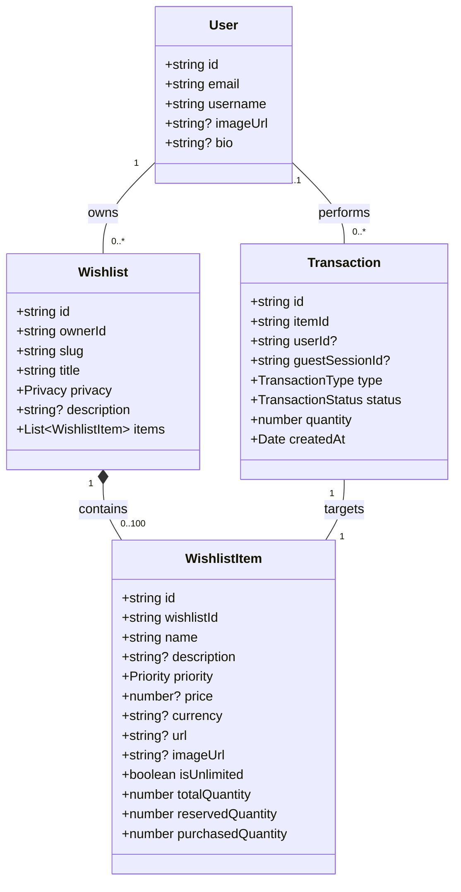
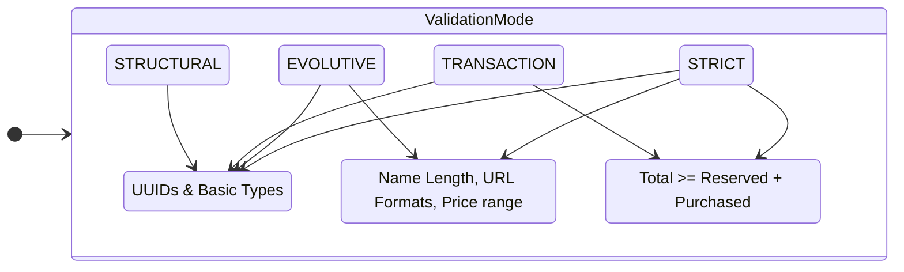

# Domain Model: Wishin

## 1. Entity Overview & Relationships

The Wishin domain is structured around a central aggregate root: the **Wishlist**. The following diagram illustrates how actors interact with the domain entities.

## 2. Validation Strategy: The Tiered Approach

To solve the **"Mother Factor"** (allowing non-technical guests to interact with legacy data) and preserve **Owner Privacy**, we use a tiered validation system.

### 2.1 Validation Matrix

| Mode            | Context                   | Structural | Business Rules | Inventory Invariants |
| :-------------- | :------------------------ | :--------: | :------------: | :------------------: |
| **STRICT**      | `create()`                | ✅ Always  |  ✅ Mandatory  |     ✅ Enforced      |
| **EVOLUTIVE**   | `update()`                | ✅ Always  |  ✅ Mandatory  | ❌ Relaxed (Privacy) |
| **TRANSACTION** | `reserve()`, `purchase()` | ✅ Always  |  ❌ Bypassed   |     ✅ Enforced      |
| **STRUCTURAL**  | Persistence/DB            | ✅ Always  |  ❌ Bypassed   |     ❌ Bypassed      |

## 3. Validation Flow

The following sequence shows how different actions trigger different validation logic within the same entity.

## 4. Key Domain Logic

### 4.1 Inventory Calculations

The entity calculates availability in real-time to prevent over-subscription during transactions:

$$Q_{available} = \max(0, Q_{total} - (Q_{reserved} + Q_{purchased}))$$

### 4.2 Reservation Pruning

When an owner reduces the `totalQuantity`, the system automatically "prunes" existing reservations to stay as close to a valid state as possible without affecting already purchased items:

$$Q_{newReserved} = \min(Q_{currentReserved}, \max(0, Q_{newTotal} - Q_{purchased}))$$

### 4.3 Privacy Preservation (Over-commitment)

In `EVOLUTIVE` mode, the system allows states where:

$$Q_{total} < Q_{reserved} + Q_{purchased}$$

This prevents the owner from discovering "secret" purchases when they try to lower the item's total quantity, maintaining the surprise factor.

### 4.4 The "Grace Period" Flow (Client-Side Undo)

To minimize friction while maintaining data integrity, anonymous actions are handled as **immediate commitments with a volatile undo window**.

1. **Immediate Action:** When a Guest clicks "Purchase", the `Transaction` is created and stock is updated.
2. **Volatile Window:** A UI popup with a countdown appears.
3. **Undo (Deletion):** If the Guest clicks "Undo" before the countdown ends or before navigating away, the `Transaction` is **hard-deleted** from the system, effectively restoring stock.
4. **Finality:** Once the user leaves the page or the window closes, the transaction is considered permanent for that session.

---

### 4.5 Cancellation vs. Undo

- **Undo:** Available to everyone. Deletes the transaction record. Only available immediately after the action.
- **Cancellation:** Available only to **Registered Users** via their "Gifting History". It transitions the transaction to a `CANCELLED` status (Soft Delete) for audit purposes.

## 5. Domain Invariants & Lifecycle

1.  **Identity Immutability:** An item's `id` cannot be changed after creation.
2.  **Atomic State Transitions:** All changes result in a new immutable `WishlistItem` instance.
3.  **Transaction Identity Invariant:** Exactly one of `userId` and `guestSessionId` MUST be set. This ensures a transaction is performed by either a registered user OR a guest, never both or neither. Enforced at creation validation.
4.  **Transaction Lifecycle:**
    - **Undo:** A hard delete of the `Transaction` record, triggered only during the active UI session.
    - **Cancellation:** A status update (`status: CANCELLED`) allowed only for registered users, which triggers a stock restock in the target `WishlistItem`.
5.  **Role Isolation:** Guests are restricted to `TRANSACTION` logic and immediate "Undo" (deletion).
